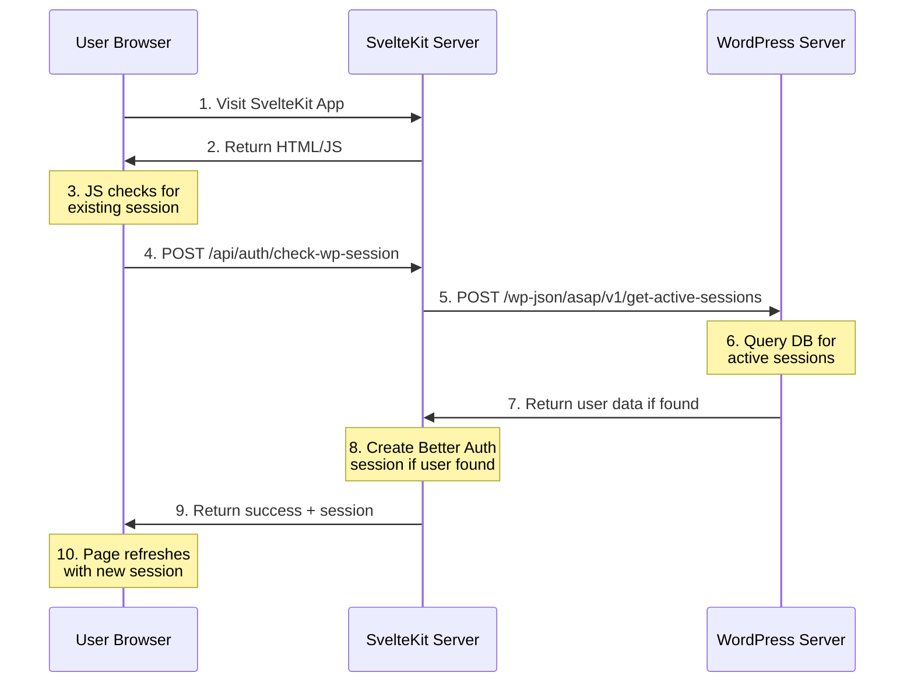

# Authentication Overview

ASAP Digest provides several authentication mechanisms to ensure secure access to resources while providing a seamless user experience.

## Authentication Methods

### Server-to-Server Auto Login (V6)

Our primary authentication mechanism is server-to-server auto login, which automatically authenticates users who are already logged into WordPress when they visit the SvelteKit application.

<CardGroup cols={2}>
  <Card title="WordPress Session Check" icon="arrow-right-to-arc" href="/api-reference/auth/wp-session-check">
    SvelteKit endpoint to check for active WordPress sessions
  </Card>
  <Card title="Active Sessions API" icon="users" href="/api-reference/wordpress/active-sessions">
    WordPress endpoint that returns active user sessions
  </Card>
</CardGroup>

### Key Features

- **No Cookie Dependency**: Unlike previous versions, V6 doesn't rely on cookies, eliminating cross-domain issues.
- **Secure Secret Sharing**: Uses a shared secret for server-to-server authentication.
- **Role-Based Access**: Configure which WordPress roles can trigger auto-login.
- **Detailed Logging**: Comprehensive logging for debugging and monitoring.

## Sequence Diagram

## Implementation Guide

For detailed implementation instructions, refer to:

- [Auto Login V6 Overview](/md-docs/auto-login/auto-login-v6)
- [Auto Login Developer Guide](/md-docs/auto-login/auto-login-developer-guide)

## Security Considerations

<Warning>
The shared secret (`BETTER_AUTH_SECRET`) should be a strong random string of at least 32 characters, and should never be exposed in client-side code.
</Warning>

In production environments, we recommend:

- Using HTTPS for all communications
- Implementing rate limiting
- Configuring IP restrictions for WordPress endpoints
- Regularly rotating the shared secret 